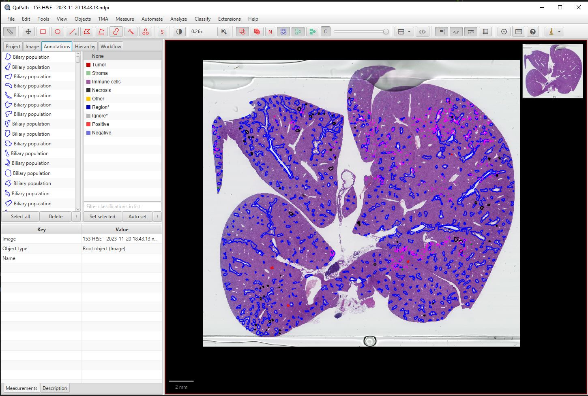

# Biliary-Cell-Population-Detection

This project aims to detect and quantify biliary cell populations in murine liver H&E slides for cholangiocarcinoma research. Using the [DUCK-Net model](https://github.com/RazvanDu/DUCK-Net), the model was trained on a single H&E slide annotated in QuPath and achieved a maximum validation Dice coefficient of **0.83**.

### Annotated Image in QuPath

### Example Result

  
  
  

